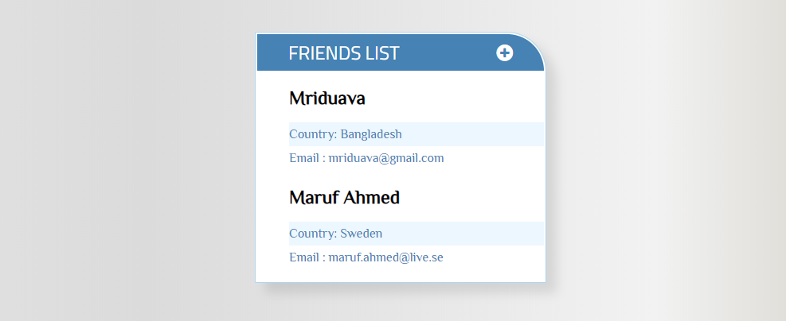

## FRIENDS LIST
A simple express app

## FUNCTIONALITY
By clicking "Plus" sign, a drop-down text-input will appear.
All data will save into mongo databse. 
Instantly it will read data from DB & will print on the screen.

## OUTLOOK

## DATABSE
MongoDb

## DATABSE
expressjs, 
ejs,
mongoose,
body-parser,
method-override

## HOW TO RUN LOCALLY
1. Clone files
2. Install dependencies
> npm-install
3. Install MongoDB & run mongo server
> mongod
4. Run local server
> node app.js    //Friend Server is Running...
5. Run the app from browser
> localhost:3020/friend
